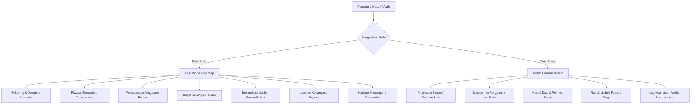

# CashMind 💰 - Private Personal Financial Management System


**CashMind** adalah aplikasi pencatatan dan pengelolaan keuangan pribadi modern berbasis **Laravel 12**, **Tailwind CSS**, **Alpine.js**, dan **Chart.js** yang menempatkan **Privasi Keuangan Pengguna sebagai prinsip utama**. 

Aplikasi ini mengusung standar tampilan **Soft Financial SaaS** dengan antarmuka yang bersih, lembut, modern, serta responsif. Dilengkapi dengan logika form interaktif, pencatatan transaksi presisi, filter multi-kriteria pada data table, pengelolaan kategori berbasis tab, serta audit rekonsiliasi kas.

---

## 🔒 Prinsip Utama & Batasan Privasi (Privacy First)

Sistem memisahkan batasan hak akses (*Role Boundary*) secara ketat di tingkat arsitektur backend dan policy:

```text
ADMIN CONSOLE
HANYA mengelola operasional PLATFORM (Pengguna, Master Data Bank, Feature Flags, Security Audit Logs)

USER WORKSPACE
HANYA mengelola FINANSIAL PRIBADI (Rekening/Dompet, Transaksi, Budget, Goals, Rekonsiliasi, Laporan)
```

> **Aturan Utama Privasi:** Data keuangan pribadi (saldo, nominal rupiah, detail transaksi, rekening, target, budget, dan laporan) **SEPENUHNYA TERISOLASI** dan **HANYA** dapat diakses oleh pemilik akun tersebut. Admin platform **SAMA SEKALI TIDAK MEMILIKI AKSES** untuk membaca, menginspeksi, ataupun mengekspor data finansial pengguna.

---

## 📋 Daftar Isi

1. [🎨 Desain Tampilan Soft Visual & Tipografi](#-desain-tampilan-soft-visual--tipografi)
2. [💡 Logika Form & Interaktivitas Form](#-logika-form--interaktivitas-form)
3. [📊 Data Table & Filter Pencarian Multi-Kriteria](#-data-table--filter-pencarian-multi-kriteria)
4. [🏷️ Pengelolaan Kategori Berbasis Tab & Sakelar Sistem](#️-pengelolaan-kategori-berbasis-tab--sakelar-sistem)
5. [👑 Admin Console & Promosi Master Data](#-admin-console--promosi-master-data)
6. [🏗️ Arsitektur & Alur Kerja Sistem](#-arsitektur--alur-kerja-sistem)
7. [🌟 Modul & Fitur Rinci Aplikasi](#-modul--fitur-rinci-aplikasi)
8. [🛠️ Teknologi & Dependensi Utilitas](#-teknologi--dependensi-utilitas)
9. [🗺️ Pemetaan Route & API Endpoints](#️-pemetaan-route--api-endpoints)
10. [🔐 Akun Demo & Data Seeder](#-akun-demo--data-seeder)
11. [🚀 Panduan Instalasi & Cara Menjalankan](#-panduan-instalasi--cara-menjalankan)
12. [📂 Struktur Direktori Project](#-struktur-direktori-project)

---

## 🎨 Desain Tampilan Redesign v4.0 (CashMind Ledger UI)

CashMind v4.0 mengusung **Mobile-First Financial Product Redesign (CashMind Ledger UI)** yang didesain khusus dari dasar untuk menghadirkan pengalaman produk finansial modern:

* **Tipografi Modern ('Manrope')**: Menggunakan font *Manrope* dari Google Fonts yang bersih untuk keterbacaan angka finansial serta memberikan kesan produk premium.
* **Skema Warna Slate, Ink & Teal**:
  * **Background**: Latar belakang bersih `#F4F6F8` dengan permukaan panel solid `#FFFFFF` (`.cm-panel`).
  * **Color Tokens**: Color Ink (`#0F172A`) sebagai warna primer navigasi & tombol utama, serta Teal (`#0F766E`) sebagai warna aksen finansial.
  * **Warna Semantik**: *Green `#15803D`* untuk Pemasukan, *Red `#B42318`* untuk Pengeluaran, dan *Amber `#B54708`* untuk Peringatan/Adjustment.
* **Arsitektur Navigasi Modern**:
  * **Desktop (Compact Navigation Rail 72px)**: Navigasi samping ringkas 72px berbasis ikon SVG dengan indikator aktif garis teal vertikal.
  * **Mobile (Fixed Bottom Navigation 64px)**: Navigasi bawah melayang (*bottom navigation*) dengan tombol aksi cepat `[ + ]` di bagian tengah untuk pencatatan transaksi yang mudah dan responsif.

---

## 💡 Logika Form & Interaktivitas Form

Seluruh form input pada CashMind dirancang dengan logika interaktif yang memudahkan pengisian data:

### 1. 💰 Real-Time Rupiah Currency Masking
* **Tampilan Input di Layar**: Pengguna mengetik nominal angka dan secara otomatis terformat dengan simbol Rupiah & pemisah ribuan secara *real-time* (contoh: **`Rp 1.000.000`**).
* **Ekstraksi Data Backend**: Sistem secara otomatis mengekstrak angka murni (contoh: **`1000000`**) ke dalam *hidden input* untuk dikirimkan ke server dan disimpan sebagai format `decimal(15,2)` di MySQL.

### 2. 🔀 Dynamic Category Selector Logic
* **Mode Pemasukan (Income)**: Pilihan dropdown kategori secara dinamis **HANYA** menampilkan kategori Pemasukan yang aktif.
* **Mode Pengeluaran (Expense)**: Pilihan dropdown kategori secara dinamis **HANYA** menampilkan kategori Pengeluaran yang aktif.
* **Mode Transfer**: Pilihan dropdown kategori secara otomatis **DISEMBUNYIKAN**, dan digantikan oleh form **Pilihan Akun Rekening Tujuan**.

### 3. 📝 Pemisahan Input Uraian & Catatan Detail
* **Uraian Transaksi (`description`)**: Bidang input wajib untuk mencatat **Untuk Apa** transaksi dilakukan (contoh: *"Makan Siang Klien", "Gaji Bulanan", "Bensin Pertamax"*).
* **Alasan / Catatan Detail (`note`)**: Bidang input opsional untuk mencatat **Mengapa / Alasan** transaksi dilakukan (contoh: *"Untuk negosiasi project baru", "Kebutuhan operasional mingguan"*).

---

## 📊 Data Table & Filter Pencarian Multi-Kriteria

Tampilan riwayat transaksi (`/app/transactions`) mengadopsi Data Table modern:

### 1. 🔍 Filter Bar Multi-Kriteria
Pengguna dapat menyaring data transaksi dengan kombinasi filter berikut:
* **Pencarian Kata Kunci**: Mencari teks pada uraian transaksi (`description`).
* **Filter Jenis Transaksi**: Pemasukan, Pengeluaran, Transfer, atau Adjustment.
* **Filter Akun / Dompet**: Menyaring transaksi berdasarkan akun rekening asal/tujuan.
* **Filter Kategori Keuangan**: Menyaring transaksi berdasarkan kategori spesifik.
* **Filter Periode**: Menyaring data berdasarkan bulan dan tahun tertentu.

### 2. 📋 Struktur Data Table & Responsif Mobile
* **Tampilan Desktop (Table View)**: Data disajikan dalam bentuk Data Table bersih dengan header berlatar `slate-50/80`, font monospaced untuk nominal rupiah, serta tombol aksi cepat hapus.
* **Tampilan Mobile (Card List View)**: Pada layar *smartphone*, tabel secara otomatis bertransformasi menjadi daftar kartu (*card list*) yang ringkas dan nyaman disentuh.
* **Empty State Illustratif**: Saat data tidak ditemukan atau belum ada transaksi, sistem menampilkan ilustrasi SVG dan pesan panduan yang ramah.

---

## 🏷️ Pengelolaan Kategori Berbasis Tab & Sakelar Sistem

Menu Kategori Keuangan (`/app/categories`) didesain agar pengguna memiliki kontrol penuh atas kategori transaksi mereka:

* **Tab Switcher (Pengeluaran vs Pemasukan)**: Memisahkan kategori pengeluaran dan pemasukan dalam dua tab terisolasi untuk menghindari kebingungan.
* **Sakelar Kategori Sistem (`Aktifkan` / `Sembunyikan`)**: Pengguna dapat mengaktifkan atau menyembunyikan kategori bawaan sistem. Kategori yang disembunyikan **tidak akan muncul** pada form pencatatan transaksi sehingga tidak ada kategori ganda/redundant yang membingungkan.
* **Kategori Kustom Mandiri**: Pengguna bebas membuat kategori kustom sendiri sesuai dengan penamaan, ikon SVG, dan tipe transaksi yang diinginkan.

---

## 👑 Admin Console & Promosi Master Data

Modul administrator (`/admin/...`) berfungsi untuk mengelola platform tanpa melanggar privasi pengguna:

* **Statistik Platform**: Menampilkan total pengguna, pengguna aktif, pengguna baru, serta kesehatan server PHP/Laravel/MySQL.
* **Manajemen Pengguna**: Mengaktifkan, menonaktifkan (*Suspend*), atau mengirim link reset password pengguna. **TIDAK ADA DATA SALDO/TRANSAKSI PENGGUNA YANG DITAMPILKAN**.
* **Promosi Saran Pengguna ke Master Data Platform**: Admin dapat melihat daftar nama kategori kustom dan nama bank/e-wallet yang dibuat oleh pengguna (tanpa melihat isi transaksi/saldo). Admin dapat mempromosikannya menjadi **Template Sistem Utama** atau **Master Platform Resmi** hanya dengan satu klik tombol.
* **Feature Flags Control**: Sakelar terpusat untuk mengaktifkan/menonaktifkan modul tertentu secara *real-time*.
* **Log Keamanan Audit**: Merekam jejak keamanan autentikasi (`LOGIN_SUCCESS`, `LOGIN_FAILED`, `ACCOUNT_SUSPENDED`).

---

## 🏗️ Arsitektur & Alur Kerja Sistem



---

## 🌟 Modul & Fitur Rinci Aplikasi

### 1. 🌐 Public Landing Page (`/`)
* Hero section interaktif dengan jaminan privasi data.
* Penjelasan 6 fitur utama, 3 alur kerja sederhana, dan FAQ accordion.

### 2. 👤 Workspace User (`/app/...`)
* **Dashboard Overview**: 4 card ringkasan total saldo, pemasukan, pengeluaran, net cash flow, Chart.js bar chart arus kas 12 bulan, dan donut chart pengeluaran per kategori.
* **Riwayat Transaksi**: Data table transaksi dengan masking rupiah, filter multi-kriteria, dan input uraian & alasan terpisah.
* **Rekening & Dompet**: Pengelolaan saldo tunai, bank, e-wallet, dan kalkulasi saldo real-time.
* **Perencanaan Anggaran**: Batas anggaran per kategori dengan indikator batas aman/warning/over-budget.
* **Target Keuangan**: Pelacakan target tabungan jangka panjang dan histori setoran.
* **Rekonsiliasi Saldo**: Audit saldo kas fisik vs catatan sistem dengan fitur otomatisasi transaksi adjustment.
* **Laporan Keuangan**: Ringkasan evaluasi arus kas dan ekspor file CSV / cetak PDF.

---

## 🛠️ Teknologi & Dependensi Utilitas

| Layer | Teknologi / Library | Keterangan / Fungsi |
|---|---|---|
| **Backend Framework** | Laravel 12 (PHP 8.2+) | MVC, RESTful Routing, Blade Engine, Strict Policy Security |
| **Database** | MySQL | Relasional Database (`users`, `accounts`, `categories`, `transactions`, `budgets`, `goals`, `user_category_toggles`, `reconciliations`, `financial_institutions`, `feature_flags`, `security_logs`) |
| **Frontend Styling** | Tailwind CSS v3 | Modern Soft Financial SaaS Design System |
| **Interaktivitas UI** | Alpine.js v3 | State management modal, dropdown, Rp masking, dynamic category selector |
| **Data Visualization** | Chart.js v4 | Bar Chart Cash Flow & Donut Chart Pengeluaran Kategori |
| **Typography & Icons** | Manrope & 100% Native Inline SVG Icons | Tipografi modern Manrope & ikonografi SVG presisi tanpa dependensi font eksternal |

---

## 🗺️ Pemetaan Route & API Endpoints

| Method | URI Path | Route Name | Controller Action | Hak Akses |
|---|---|---|---|---|
| `GET` | `/` | `landing` | `LandingController@index` | Public |
| `GET` | `/dashboard` | `dashboard` | `DashboardController@index` | Authenticated (Auto-Route) |
| `GET` | `/app/dashboard` | `user.dashboard` | `UserDashboardController@index` | `auth`, `role:user`, `active` |
| `GET` | `/app/transactions` | `user.transactions.index` | `TransactionController@index` | `auth`, `role:user`, `active` |
| `POST` | `/app/transactions` | `user.transactions.store` | `TransactionController@store` | `auth`, `role:user`, `active` |
| `DELETE`| `/app/transactions/{id}`| `user.transactions.destroy` | `TransactionController@destroy` | `auth`, `role:user`, `active` |
| `GET` | `/app/accounts` | `user.accounts.index` | `AccountController@index` | `auth`, `role:user`, `active` |
| `POST` | `/app/accounts` | `user.accounts.store` | `AccountController@store` | `auth`, `role:user`, `active` |
| `GET` | `/app/budget` | `user.budget.index` | `BudgetController@index` | `auth`, `role:user`, `active` |
| `POST` | `/app/budget` | `user.budget.store` | `BudgetController@store` | `auth`, `role:user`, `active` |
| `GET` | `/app/categories` | `user.categories.index` | `CategoryController@index` | `auth`, `role:user`, `active` |
| `POST` | `/app/categories/{id}/toggle-system`| `user.categories.toggle-system`| `CategoryController@toggleSystem`| `auth`, `role:user`, `active` |
| `GET` | `/app/goals` | `user.goals.index` | `GoalController@index` | `auth`, `role:user`, `active` |
| `POST` | `/app/goals/{id}/contribute`| `user.goals.contribute` | `GoalController@contribute` | `auth`, `role:user`, `active` |
| `GET` | `/app/reconciliation` | `user.reconciliation.index`| `ReconciliationController@index`| `auth`, `role:user`, `active` |
| `POST` | `/app/reconciliation` | `user.reconciliation.store`| `ReconciliationController@store`| `auth`, `role:user`, `active` |
| `GET` | `/app/reports` | `user.reports.index` | `ReportController@index` | `auth`, `role:user`, `active` |
| `GET` | `/app/reports/csv` | `user.reports.csv` | `ReportController@exportCsv` | `auth`, `role:user`, `active` |
| `GET` | `/admin/dashboard` | `admin.dashboard` | `AdminDashboardController@index` | `auth`, `role:admin` |
| `GET` | `/admin/users` | `admin.users.index` | `UserController@index` | `auth`, `role:admin` |
| `POST` | `/admin/users/{user}/toggle-status` | `admin.users.toggle-status` | `UserController@toggleStatus` | `auth`, `role:admin` |
| `GET` | `/admin/master-data` | `admin.master.index` | `MasterDataController@index` | `auth`, `role:admin` |
| `POST` | `/admin/master-data/promote-category` | `admin.master.category.promote` | `MasterDataController@promoteCategoryTemplate` | `auth`, `role:admin` |
| `POST` | `/admin/master-data/promote-institution` | `admin.master.institution.promote` | `MasterDataController@promoteInstitution` | `auth`, `role:admin` |
| `GET` | `/admin/features` | `admin.features.index` | `FeatureController@index` | `auth`, `role:admin` |
| `GET` | `/admin/logs` | `admin.logs.index` | `SecurityLogController@index` | `auth`, `role:admin` |

---

## 🔐 Akun Demo & Data Seeder

| Role | Email | Password | Hak Akses Utama |
|---|---|---|---|
| 👑 **Super Admin** | `admin@cashmind.id` | `password` | Platform Operations, User Management, Master Data & Promosi Saran, Feature Flags, Audit Logs *(Tanpa Akses Finansial User)* |
| 👤 **Personal User** | `user@cashmind.id` | `password` | Personal Workspace, Kelola Rekening/Dompet, Transactions, Budget Planning, Financial Goals, Rekonsiliasi, Laporan CSV/PDF |

---

## 🚀 Panduan Instalasi & Cara Menjalankan

### 1. Prasyarat Sistem
* PHP versi `>= 8.2`
* Composer versi `>= 2.x`
* Database MySQL Server
* Web Browser Modern

### 2. Langkah Instalasi

1. **Clone Repositori Project**:
   ```bash
   git clone https://github.com/AdiRizkyR/CashMind.git
   cd CashMind
   ```

2. **Install Dependensi Composer**:
   ```bash
   composer install
   ```

3. **Konfigurasi Environment (`.env`)**:
   ```bash
   cp .env.example .env
   php artisan key:generate
   ```
   Sesuaikan baris konfigurasi database MySQL di file `.env` (misal: `DB_DATABASE=cashmind`).

4. **Jalankan Migrasi & Seeder Database**:
   ```bash
   php artisan migrate:fresh --seed
   ```

5. **Jalankan Server Lokal**:
   ```bash
   php artisan serve
   ```
   Akses aplikasi melalui browser pada alamat: **`http://127.0.0.1:8000`**.

---

## 📂 Struktur Direktori Project

```text
CashMind/
├── app/
│   ├── Http/
│   │   ├── Controllers/
│   │   │   ├── Admin/             # Controllers Admin Console (Dashboard, Users, MasterData, Features, SecurityLog)
│   │   │   ├── User/              # Controllers User Workspace (Dashboard, Transactions, Accounts, Budget, Categories, Goals, Reconciliation, Reports)
│   │   │   ├── DashboardController.php
│   │   │   └── LandingController.php
│   │   └── Middleware/            # Middleware Access Control (EnsureRole, EnsureUserIsActive)
│   ├── Models/                    # Eloquent Models (User, Account, Transaction, Category, UserCategoryToggle, Budget, Goal, Reconciliation, dll.)
│   └── Policies/                  # FinancialPrivacyPolicy (Strict User Data Isolation)
├── database/
│   ├── migrations/                # Schema Migration CashMind v2
│   └── seeders/                   # Data Seeder Akun Demo, Master Institutions, & Categories
├── resources/
│   ├── views/
│   │   ├── admin/                 # Blade Views Admin Console (100% Bahasa Indonesia)
│   │   ├── user/                  # Blade Views User Workspace (100% Bahasa Indonesia, Soft UI & Masking Rupiah)
│   │   ├── layouts/               # Base Layouts (app, user, admin)
│   │   └── welcome.blade.php      # Public Landing Page
├── routes/
│   ├── web.php                    # Routes Web Aplikasi
│   └── auth.php                   # Routes Autentikasi Breeze
├── guideline.md                    # Dokumentasi Spesifikasi Arsitektur CashMind v2
└── README.md                      # Dokumentasi Resmi Aplikasi CashMind
```

---

## 📄 Lisensi & Hak Cipta

Proyek ini dilisensikan di bawah **[MIT License](LICENSE)**.

Dibuat & Dikembangkan oleh **Aditya Personal / CashMind Development Team 2026**.
